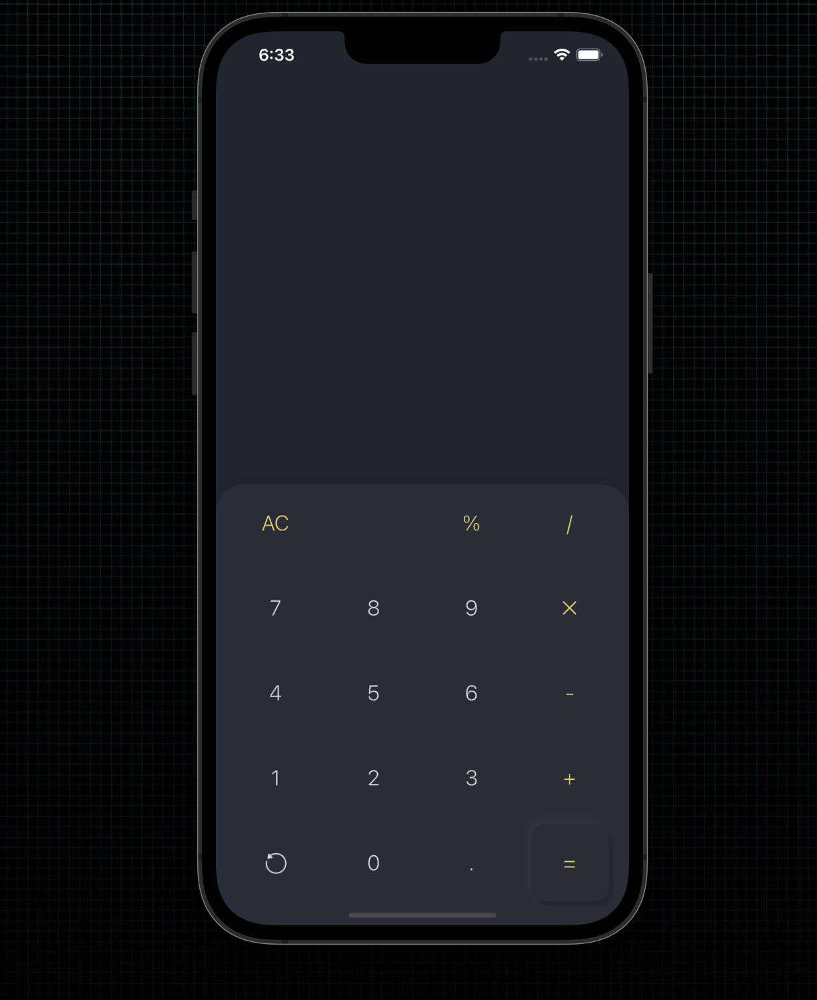
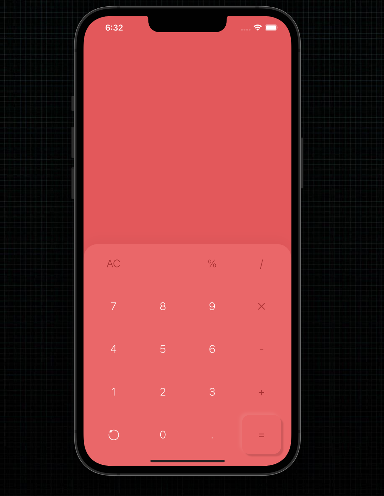
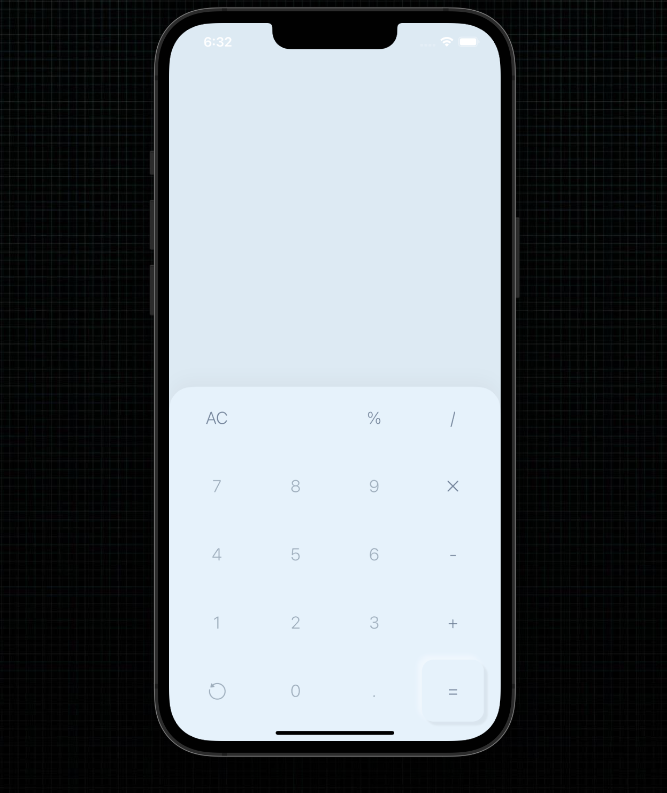
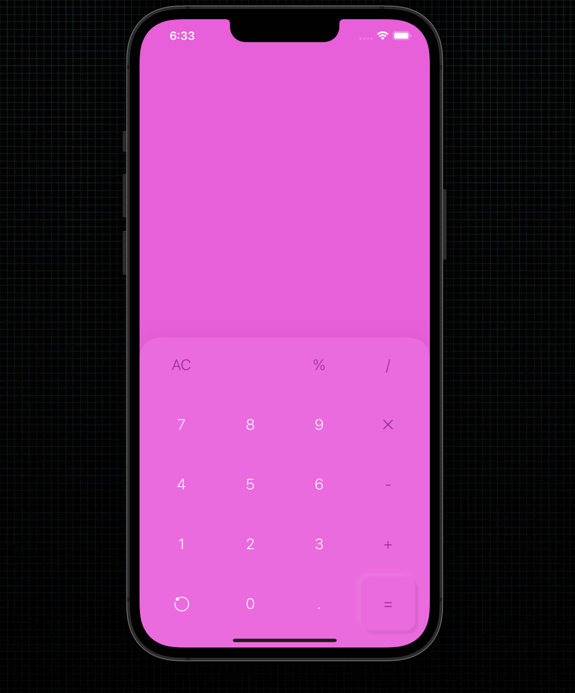
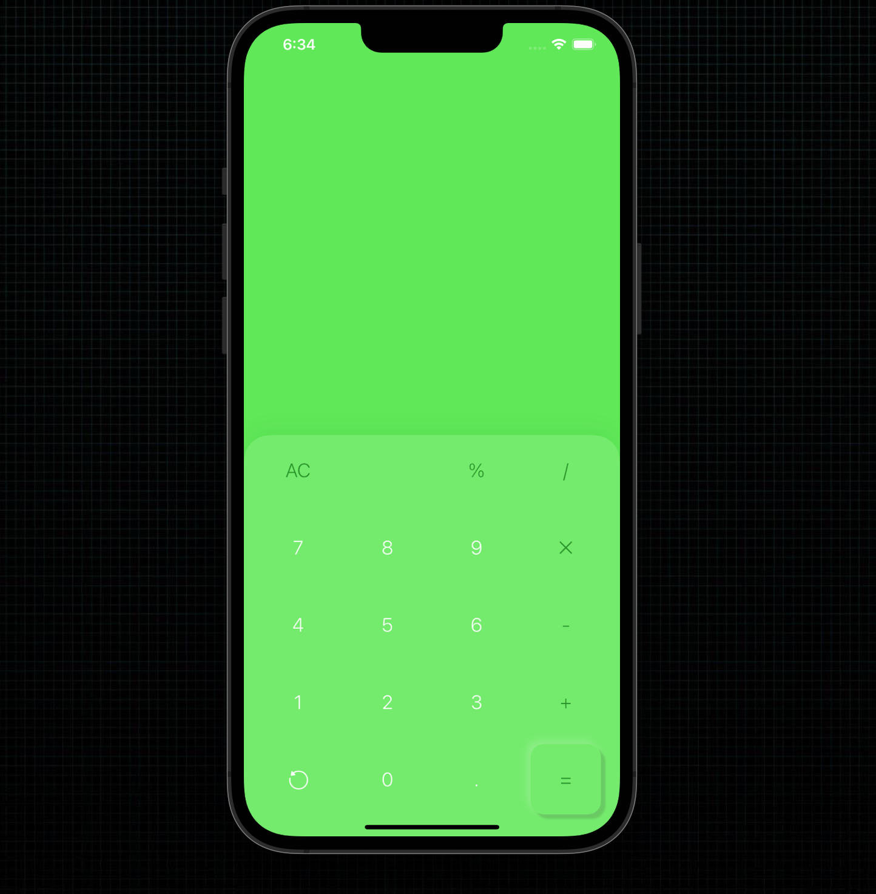
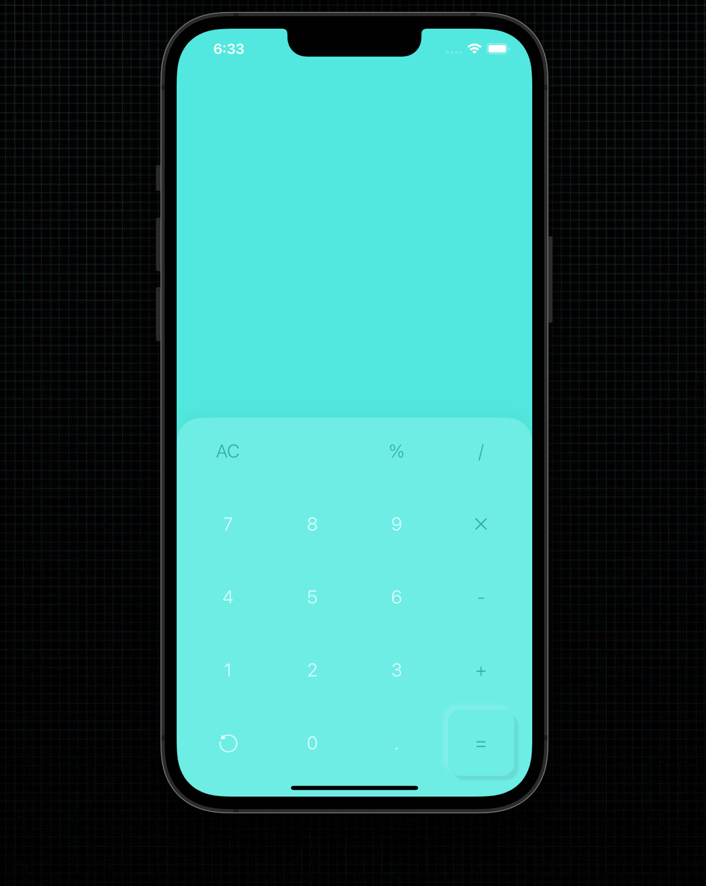

# Neomorphic calculator
## Screenshots 

## About 
This project is not a complete calculator(the operations are not implemented). This projects is only to showcase neomorphism(in the most basic design) in different Colors.
